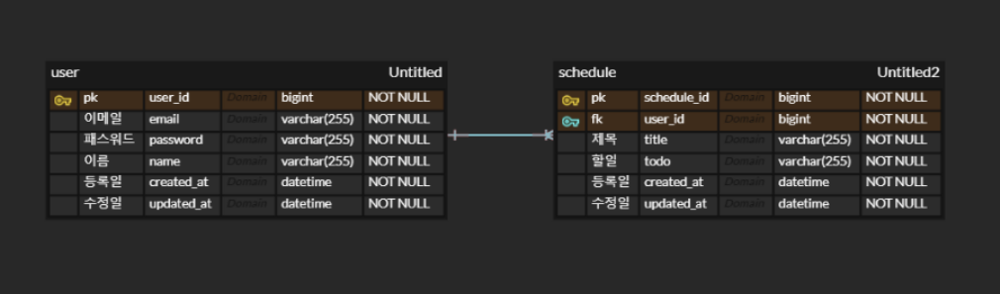

# 일정 관리 앱 만들기 과제

일정을 관리할 수 있는 앱 API 만들기

## 프로젝트 목표

- `SpringBoot`와 `REST API`의 기본적인 `CRUD` 작성
- `3 Layer Architecture`의 목적에 맞게 개발
- `JDBC`를 사용해 데이터베이스와의 연동

## 주요 기능

- 유저
    - 유저는 회원가입, 로그인, 로그아웃을 할 수 있다.
- 일정
    - 전체
        - 일정을 검색할 수 있다.
            - 최근 수정일을 기준
            - 유저와 수정일을 이용해 필터 검색이 가능하다.
    - 유저
        - 일정을 생성할 수 있다.
        - 본인의 일정을 수정, 삭제할 수 있다.

## API 명세서

- [REST Docs](http://localhost:63342/schedule/schedule.main/static/docs/index.html)

## ERD

## 기능 요구 사항

### 공통 조건

- 일정 작성, 수정, 조회 시 반환 받은 일정 정보에 `비밀번호`는 제외해야 합니다.
- 일정 수정, 삭제 시 선택한 일정의 `비밀번호`와 요청할 때 함께 보낸 `비밀번호`가 일치할 경우에만 가능합니다.
    - 비밀번호가 일치하지 않을 경우 적절한 오류 코드 및 메세지를 반환해야 합니다.
- `3 Layer Architecture` 에 따라 각 Layer의 목적에 맞게 개발해야 합니다.
- CRUD 필수 기능은 모두 데이터베이스 연결 및 `JDBC` 를 사용해서 개발해야 합니다.
    - JDBC 설정은 강의와 강의에서 제공해주는 코드 스니펫을 참고하셔도 됩니다.
    - 잠깐! 왜 JPA가 아닌 JDBC로 하나요?
        - 데이터베이스와의 연동을 위해 JDBC를 사용해보며, 기본적인 SQL 쿼리 작성과 데이터 관리를 연습합니다.
        - JPA에 비해, 첫 시도로 좋은 연습 상대가 될거에요! 충분히 익숙해지고 난 후, JPA를 도입합니다!

### Lv 0. API 명세 및 ERD 작성

- **API 명세서 작성하기**
    - API명세서는 프로젝트 root(최상위) 경로의 `README.md` 에 작성
    - 참고) API 명세서 작성 가이드
        - API 명세서란 API명, 요청 값(파라미터), 반환 값, 인증/인가 방식, 데이터 및 전달 형식 등 API를 정확하게 호출하고 그 결과를 명확하게 해석하는데 필요한 정보들을 일관된 형식으로 기술한
          것을 의미합니다.
        - request 및 response는 `JSON` 형태로 작성합니다.
- **ERD 작성하기**
    - ERD는 프로젝트 root(최상위) 경로의 `README.md` 에 첨부
    - 참고) ERD 작성 가이드
        - API 명세 작성을 통해 서비스의 큰 흐름과 기능을 파악 하셨다면 이제는 기능을 구현하기 위해 필요한 데이터가 무엇인지 생각해봐야합니다.
            - 이때, 구현해야 할 서비스의 영역별로 필요한 데이터를 설계하고 각 영역간의 관계를 표현하는 방법이 있는데 이를 ERD(Entity Relationship Diagram)라 부릅니다.
        - ERD 작성간에 다음과 같은 항목들을 학습합니다.
            - E(Entity. 개체)
                - 구현 할 서비스의 영역에서 필요로 하는 데이터를 담을 개체를 의미합니다.
                    - ex) `책`, `저자`, `독자`, `리뷰`
            - A(Attribute. 속성)
                - 각 개체가 가지는 속성을 의미합니다.
                    - ex) 책은 `제목`, `언어`, `출판일`, `저자`, `가격` 등의 속성을 가질 수 있습니다.
            - R(Relationship. 관계)
                - 개체들 사이의 관계를 정의합니다.
                    - ex) `저자`는 여러 권의 `책`을 집필할 수 있습니다. 이때, 저자와 책의 관계는 일대다(1:N) 관계입니다.
- **SQL 작성하기**
    - 설치한 데이터베이스(Mysql)에 ERD를 따라 테이블을 생성
    - 참고) SQL 작성 가이드
        - 과제 프로그램의 root(최상위) 경로에`schedule.sql` 파일을 만들고, 테이블 생성에 필요한 query를 작성하세요.

### Lv 1. 일정 생성 및 조회

- **일정 생성(일정 작성하기)**
    - 일정 생성 시, 포함되어야할 데이터
        - `할일`, `작성자명`, `비밀번호`, `작성/수정일`을 저장
        - `작성/수정일`은 날짜와 시간을 모두 포함한 형태
    - 각 일정의 고유 식별자(ID)를 자동으로 생성하여 관리
    - 최초 입력 시, 수정일은 작성일과 동일
- **전체 일정 조회(등록된 일정 불러오기)**
    - 다음 조건을 바탕으로 등록된 일정 목록을 전부 조회
        - `수정일` (형식 : YYYY-MM-DD)
        - `작성자명`
    - 조건 중 한 가지만을 충족하거나, 둘 다 충족을 하지 않을 수도, 두 가지를 모두 충족할 수도 있습니다.
    - `수정일` 기준 내림차순으로 정렬하여 조회
- **선택 일정 조회(선택한 일정 정보 불러오기)**
    - 선택한 일정 단건의 정보를 조회할 수 있습니다.
    - 일정의 고유 식별자(ID)를 사용하여 조회합니다.

### Lv 2. 일정 수정 및 삭제

- **선택한 일정 수정**
    - 선택한 일정 내용 중 `할일`, `작성자명` 만 수정 가능
        - 서버에 일정 수정을 요청할 때 `비밀번호`를 함께 전달합니다.
        - `작성일` 은 변경할 수 없으며, `수정일` 은 수정 완료 시, 수정한 시점으로 변경합니다.
- **선택한 일정 삭제**
    - 선택한 일정을 삭제할 수 있습니다.
        - 서버에 일정 수정을 요청할 때 `비밀번호`를 함께 전달합니다.

### Lv 3. 연관 관계 설정

- **작성자와 일정의 연결**
    - 설명
        - 동명이인의 작성자가 있어 어떤 작성자가 등록한 ‘할 일’인지 구별할 수 없음
        - 작성자를 식별하기 위해 이름으로만 관리하던 작성자에게 고유 식별자를 부여합니다.
        - 작성자를 할 일과 분리해서 관리합니다.
        - 작성자 테이블을 생성하고 일정 테이블에 FK를 생성해 연관관계를 설정해 봅니다.
    - 조건
        - 작성자는 `이름` 외에 `이메일`, `등록일`, `수정일` 정보를 가지고 있습니다.
            - 작성자의 정보는 추가로 받을 수 있습니다.(조건만 만족한다면 다른 데이터 추가 가능)
        - 고유 식별자를 통해 작성자를 조회할 수 있도록 기존 코드를 변경합니다.
        - 작성자의 고유 식별자가 일정 테이블의 외래키가 될 수 있도록 합니다.

### Lv 4. 페이지네이션

- 설명
    - 많은 양의 데이터를 효율적으로 표시하기 위해 데이터를 여러 페이지로 나눕니다.
        - `페이지 번호`와 `페이지 크기`를 쿼리 파라미터로 전달하여 요청하는 항목을 나타냅니다.
        - 전달받은 페이지 번호와 크기를 기준으로 쿼리를 작성하여 필요한 데이터만을 조회하고 반환
- 조건
    - 등록된 일정 목록을 `페이지 번호`와 `크기`를 기준으로 모두 조회
    - 조회한 일정 목록에는 `작성자 이름`이 포함
    - 범위를 넘어선 페이지를 요청하는 경우 빈 배열을 반환
    - Paging 객체를 활용할 수 있음

### Lv 5. 예외 발생 처리

- 설명
    - 예외 상황에 대한 처리를 위해 `HTTP 상태 코드`와 `에러 메시지`를 포함한 정보를 사용하여 예외를 관리할 수 있습니다.
        1. 필요에 따라 사용자 정의 예외 클래스를 생성하여 예외 처리를 수행할 수 있습니다.
        2. `@ExceptionHandler`를 활용하여 공통 예외 처리를 구현할 수도 있습니다.
        3. 예외가 발생할 경우 적절한 HTTP 상태 코드와 함께 사용자에게 메시지를 전달하여 상황을 관리합니다.

- 조건
    - 수정, 삭제 시 요청할 때 보내는 `비밀번호`가 일치하지 않을 때 예외가 발생합니다.
    - 선택한 일정 정보를 조회할 수 없을 때 예외가 발생합니다.
        1. 잘못된 정보로 조회하려고 할 때
        2. 이미 삭제된 정보를 조회하려고 할 때

### Lv 6. null 체크 및 특정 패턴에 대한 검증 수행

- 설명
    - 유효성 검사
        1. 잘못된 입력이나 요청을 미리 방지할 수 있습니다.
        2. 데이터의`무결성을 보장`하고 애플리케이션의 예측 가능성을 높여줍니다.
        3. Spring에서 제공하는`@Valid`어노테이션을 이용할 수 있습니다.
- 조건
    - `할일`은 최대 200자 이내로 제한, 필수값 처리
    - `비밀번호`는 필수값 처리
    - 담당자의 `이메일` 정보가 형식에 맞는지 확인